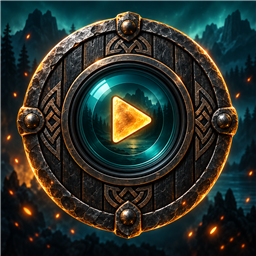
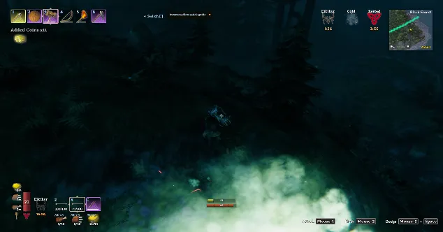
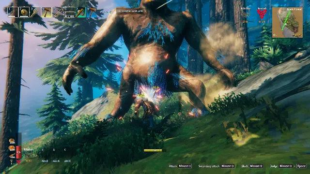

# Valheim Moments

0.23.1 keeps Barely Survived in slow motion through the hit's immediate aftermath, adds independent boss-equivalent controls and experimental cameras for special enemies, and adds biome camera movement choices with cinematic letterboxing. The GitHub and Thunderstore README fixes and animated gameplay examples are included. Existing camera distance, obstruction handling and boss/raid movement options carry forward. Live camera/co-op acceptance remains required.

**0.18 adds the personal gallery:** F8 opens history, F7 keeps a memory, and thumbnails remain after temporary footage expires. Successful unpinned uploads get a 30-second Keep grace. Recovery defaults to 20 clips / 250 MiB / 24 hours; kept originals are permanent. Retry is limited to three attempts in the original session, with backoff and explicit duplicate confirmation for unknown delivery. Both keys and recovery limits are player controlled.

Raid opening/ending and close-call source/playback durations are now host configurable. Exact host-issued raid identities support grouped participant perspectives; missing identity stays personal. Live gallery interaction, raid grouping, customized timelines and sustained performance still require the final gameplay pass.

## Upgrading

Update normally through your mod manager; no scripts or manual history migration are required. After upgrading from an older version, you may see discoveries one more time if the updater removed their old history. The mod now saves discoveries outside the plugin folder, so recorded discoveries will no longer repeat when the server restarts. This applies to biomes, enabled sub-biomes, traders and named locations for each character and world.



Animated gameplay highlights for Valheim: manual captures, player deaths, boss kills
and great loot, plus first discoveries and selected special enemies, with optional Epic Loot details and host-controlled Discord delivery.

**Windows x64 beta - version 0.23.1.** Manual capture, deaths, boss/loot clips,
Epic Loot details, natural-loot acquisitions and host/client F10 delivery have passed
user testing in earlier versions. This milestone connects the multiplayer director: compatible creature-death recordings can share one Discord post with up to three labeled perspectives. First discoveries and configurable special enemies from 0.14 are included. Settings/sizing, notifications and death-rate improvements from 0.12/0.13 are included. New exploration hooks, visual/audio paths and live co-op behavior remain to be verified.

See [player instructions and settings](release/README.md). The build produces a
Thunderstore-ready archive; generating it does not publish or approve a listing.
Dedicated hosting, detailed natural-loot edge cases, host-settings UI/sync and sustained
performance testing remain on the documented acceptance checklists.

0.16 adds host-controlled close-call clips: survive twenty seconds after damage crosses the low-health threshold, then share a ten-second slow/fast animation. Death cancels the attempt. Automated collection/encoding checks pass; live close-call acceptance is pending.

0.17 adds personal raid clips: a four-second opening and six-second aftermath, delivered together as “Raid ended.” Leaving, dying, policy loss or capture reconfiguration abandons the attempt. Live raid acceptance remains pending.

See the [development plan](docs/DEVELOPMENT-PLAN.md) for implementation history and acceptance gates.

## See it in action

Animated gameplay examples. Player names are supplied; the remaining caption details below are fictional examples of Discord output, not verified contents of the footage.

### Mec's death



> **💀 Mec died!**
>
> **Recorded by:** Mec
>
> **Cause:** Troll

### Ren's legendary drop



> **Great loot from Skeleton!**
>
> **Recorded by:** Ren
>
> **Kill credit:** Ren
>
> **Loot**
>
> - **Legendary Iron sword** x1
>   - +25% physical damage
>   - +15% attack speed
> - Bone fragments x6
> - Coins x42

## Build from source

Requirements: Windows x64, a .NET SDK capable of building netstandard2.1/net48 (tested
with SDK 10.0.401), installed Valheim, and a BepInEx-enabled Valheim profile. Running
the helper requires .NET Framework 4.8. No game or BepInEx assemblies are included here.

1. Copy `local.props.example` to `local.props`.
2. Set `GamePath` to your Valheim installation and `ProfilePath` to your BepInEx profile.
3. From PowerShell in the repository root, run:

```powershell
./tools/Build-Prototype.ps1 -Restore
./tools/Build-Thunderstore.ps1
```

The first command restores pinned NuGet packages and builds/tests a local package.
The second validates and creates `artifacts/Valheim_Moments-0.23.1.zip`, including
manifest, README, changelog, icon, plugin, encoder and license notices. It does not
publish anything. Do not reupload changed contents under an already published version.

Close Valheim before installing into a development profile:

```powershell
./tools/Install-Prototype.ps1 -ProfilePath 'C:\path\to\your\Valheim\profile'
```

The installer backs up the previous plugin and preserves configuration. Keep only one
installed copy when switching between a manual install and the mod manager.

## Verification

Run all automated release checks and generate the Thunderstore package plus a DLL
provenance report with one command:

```powershell
./tools/Test-Release.ps1
```

This restores pinned dependencies, runs capture/event/relay/fake-HTTP tests, builds
and validates the package, checks encoder output, and compares bundled library DLLs
with their original NuGet archive entries. It verifies package signatures and archive
checksums, and checks restored content hashes against the lockfile. The report is
`artifacts/BINARY-PROVENANCE.md`.
It does not install the mod or publish anything. Live acceptance remains separate.
Use `-SkipRestore` only when dependencies are already restored.

Individual checks are also available:

```powershell
./tools/Test-Core.ps1
./tools/Test-Discord.ps1
./tools/Test-Encoder.ps1
./tools/Test-EncoderFormat.ps1
dotnet restore tests/DeathTests.csproj --configfile NuGet.Config
dotnet build tests/DeathTests.csproj -c Release --no-restore
./tests/bin/Release/net48/DeathTests.exe
```

Event tests use behavioral game/API stand-ins with real Harmony; the production build
separately checks compatibility against the supplied installed game assemblies.
Discord tests use fake HTTP and never send messages. Relay tests simulate connected
peers; they are not a replacement for Steam/PlayFab or dedicated-server testing.
Encoder tests check RIFF timing, full decode, color channels, vertical flip, unequal
frame durations, cancellation and malformed input.

See [capture checks](docs/PROTOTYPE-TEST.md), [natural loot checks](docs/NATURAL-LOOT-TEST.md)
and [co-op checks](docs/RELAY-TEST.md).

## How it works

- A bounded five-second RGBA history uses GPU downsampling and asynchronous readback.
- A trigger retains recent frames and collects post-event footage. Extra triggers are
  skipped while a clip is collecting or encoding.
- A hidden helper receives frames through a pipe and encodes animated WebP using
  libwebp on one encoding thread. Only the completed media is written to disk.
- Harmony observers correlate player deaths, credited kills and generated
  loot. Natural treasure gets a small provenance marker in item custom data, consumed
  on acquisition or transfer; player storage and gravestones are excluded. Optional Epic Loot integration reads completed item data without rerolling it.
- In multiplayer, direct peer RPCs send bounded clip transfers to the host. Webhook
  URLs and bot name stay host-owned. Successful uploads delete local clips by default;
  each recording player can retain them with SaveLocalCopy=true.

The host accepts client event captions and fixed event types, adds a recorder name
from the connected peer, and applies its own destination settings. It does not verify
that client footage depicts the claimed event. Relay transfers are limited to 10 MiB,
one incoming transfer/upload at a time, with pacing and timeouts. No automatic binary
updates or runtime executable downloads are performed.

## Configuration and privacy

The plugin GUID is `local.valheimmoments`; the config is `local.valheimmoments.cfg`.
See the [complete configuration reference](docs/CONFIGURATION.md) for defaults,
limits and host/client ownership, and [integration notes](docs/INTEGRATIONS.md) for
every Harmony patch, the capture pipeline, validation evidence and remaining tests.
Version 0.9.0 renames the technical identity. Before upgrading an older install, close
Valheim and migrate its config to the new filename, preserve its Clips folder, and
remove the previous plugin from the active profile. The development installer supports
explicit `-PreviousPluginDirectory` and `-PreviousConfigPath` arguments for this upgrade.
The generated config can contain Discord webhook secrets: **do not commit or share it**.
Local paths, configs, footage, logs, game assemblies, build outputs and internal
working notes are excluded from Git. The icon and source code are included.

## Future Roadmap

These are future ideas, not features included in this release. Prioritize game-provided
events and saved progression data so new content needs as little mod maintenance as
possible. Host configuration should control categories, filters, first-time rules and
cooldowns; avoid needing a new build just to add an enemy or achievement identifier.
Game API changes can still require compatibility updates.

* Extend discovery coverage where additional reliable game events are available.
* Selected achievement unlocks, driven by the game's achievement definitions rather than a hardcoded list.
* Director fallback encoding and larger transfer budgets, survival-validated close calls, and a personal gallery with Keep and bounded retries.
* Optional raid start/completion highlights, with per-event controls and cooldowns.
* Group overlapping progression events to avoid duplicate posts for the same moment.

## License and attribution

Original project code is licensed under [MIT](LICENSE), copyright 2026 Pendulum.
Dependency licenses and source provenance are in [third-party/webp](third-party/webp)
and [DEPENDENCIES.md](docs/DEPENDENCIES.md). Game, Unity, BepInEx, Harmony and Epic Loot
binaries are not redistributed.

Significant portions of the code and icon were created with AI tools. The Thunderstore
listing is categorized AI Generated. This is an unofficial community project with no
affiliation with Iron Gate or Coffee Stain.
